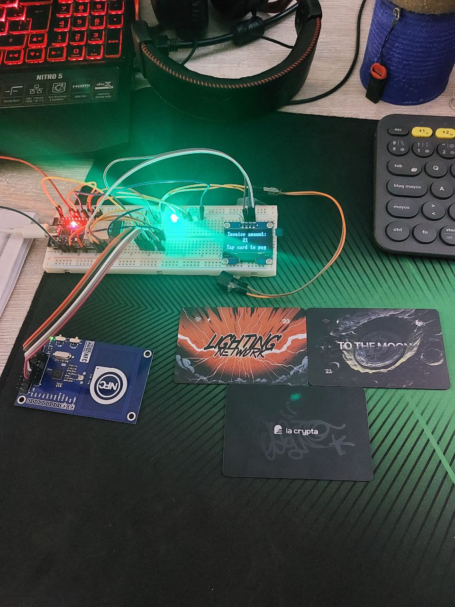
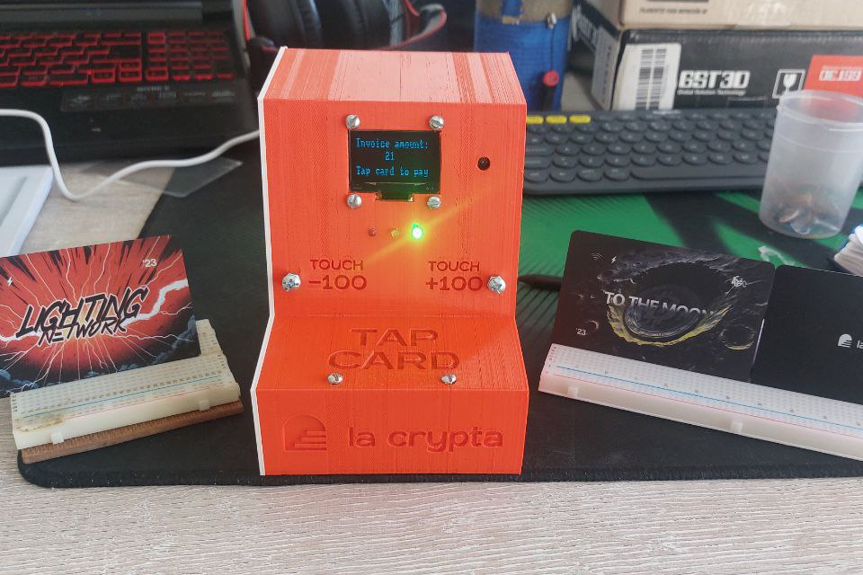
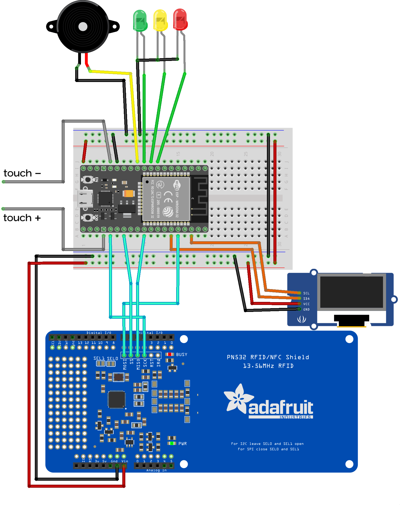

# RapiPOX

> **Rap**ax **P**oint **O**f e**X**tensions.
 
> Hardware dispositive with multiple extensions (in progress) realted with Lightning Network and NOSTR.

---

1. [Images](#images)
2. [About the project](#about-the-project)
    1. [Vision](#vision)
    2. [Mision](#mision)
    3. [Community](#community)
3. [Hardware equirements](#hardware-requirements)
    1. [Electronic](#electronic)
    2. [Case and others](#case-and-others)
4. [Setup](#setup)
    1. [Hardware Setup](#hardware-setup)
    2. [Development Enviroment Setup](#development-enviroment-setup)
5. [Developing](#developing)
    1. [Code](#code)
    2. [Others](#others)
    3. [Extensions](#extensions)

---

## Images

    
    
    

## About the project

### Mision

Aims to be a device with multiple extensions related to **Lightning Network** and **NOSTR**.
The connection between **the digital** (LN and NOSTR) and **the analog** (human senses), that is, all virtual actions and interactions have an impact on hardware of the real world.

### Vision

Offer to people, entrepreneurs, merchants, sales premises, etc. the possibility of **playing** and/or **obtaining money** through extensions in a **simple way**, both for the owner of the device and for the user. And most importantly, **bitcoinize the galaxy**.

### Community

This project born in  [La Crypta](https://lacrypta.ar/), argentinian bitcoiner community. Your are invited to join a [our Discord](https://discord.lacrypta.ar) to continue the talk of this project and build more.

## Hardware Requirements

### Electronic

1. ESP-WROOM-32.
2. Display OLED 0.96" 128x32 pixels.
3. NFC module PN532 13.56MHz.
4. x3 LEDs (I use red, yellow and green).
5. Buzzer.

### Case and others

1. 3D case. (files available soon).
2. x12 screw 1/8x3/8 inchs and its correspondin nut, and x2 additional nuts for touch screw.
3. USB cable.
4. breadboard 400 points.
5. Several breadboard wires (Male-Male and Male-Female).

In the future would I like to make a PCB.

## Setup

Setting up this project entails two main parts:

1. hardware setup, and
2. setting up your development evoirement using [PlatformIO IDE](https://platformio.org/) extension in VSCode.

### Hardware Setup

This setup is for the test in a breadboard.

At the final of this section you will find an image with the electronic connections. [Click here to go](#image-of-the-circuit-connections).

1. Connect your ESP32 in a breadboard.
2. Connect the 5V (pin `19`) and the GND (pin `14`) of your ESP32 to power channels (From now on I will call it VCC channel and GND channel accordingly) of the breadboard. And connect both power channels to each other accordingly (GND channel with GND channel and VCC channel with VCC channel).
3. Connect the modules and peripherals as follow.

#### Modules and pins

##### Buzzer, LEDs and touches

All the cathodes of the LEDs and the GND of the buzzer are connected to the GND channel.

| peripheral    | pin   |
|---------------|-------|
| buzzer        | 36    |
| green         | 25    |
| yellow        | 33    |
| red           | 32    |
| touch -       | 13    |
| touch +       | 15    |

For the test, touches are a simple open wire.

##### Screen

`name in board` is a common name that the pins are on the module usually have.

| name in board | pin           |
|---------------|---------------|
| SCK           | 22            |
| SDA           | 21            |
| VCC           | VCC channel   |
| GND           | GND channel   |

##### NFC lector

Someone modules have a two switches to change communication type. Check it to be in SPI communication.

| name in board | pin           |
|---------------|---------------|
| MOSI/TX/SDA   | 3             |
| SS/RX/SCL     | 4             |
| MISO          | 5             |
| SCK           | 2             |
| VCC           | VCC channel   |
| GND           | GND channel   |

#### Image of the circuit connections

### Development Enviroment Setup 

1. Install [PlatformIO extension](https://platformio.org/install/ide?install=vscode) in VSCode. I recomend looking at this [Quick Start Guide](https://docs.platformio.org/en/latest/integration/ide/vscode.html#quick-start).
2. Clone this repo within `~/PlatformIO/Projects` directory.
3. Import the project from *PlatformIO: Home* and open it.

#### `env.hpp` Setup

1. Copy `env.hpp.example` content to `env.hpp` (create it).
2. Change the placeholder values (ie. `*ENV_...` strings):
    1. replace `*ENV_SSID` for you WiFi SSID. **It is important that the network must is 2.4GHz** (5GHz networks don't are detected),
    2. replace `*ENV_PASS` for you WiFi password,
    3. replace `*ENV_LNURL` for your [LNURL](https://github.com/lnurl/luds/blob/luds/16.md), included domain (ie. `user@domain`). Obtain your user@lawallet.ar 👉 [here](https://lawallet.ar/) 👈.

#### Run the RapiPOX

1. Connect your ESP32.
2. Upload project using PlatformIO.

## Developing

> **NOTE:** Probably, in the future (not too far), update the ESP32 to Raspberry Zero or similary to upgrade the power of RapiPOX.

### Code

#### Done

- [x] Turn off NTAG424 debug.
- [x] LEDs and status buzzer.
- [x] Customizable amount of invoice.
- [x] Make a README as [mpr](https://github.com/mariano-perez-rodriguez) would like.

#### To Do

- [ ] Replace HTTP request for Websocket connection to my own sever.
- [ ] Beautifuly code.
    - [x] Rename task with camelCase.
    - [x] Separate tips code of the loop. (ex-*Modularize extensions*)
    - [ ] Add debug define to extensions/tips/*
    - [ ] Visual Home Menu.
    - [ ] Add elegible/activate extension to Home Menu. (Add extension thread to loop).
    - [ ] Task parameters (delete global variables).
    - [ ] Normalize and documentate names:
        - thread: multithreading extension code
        - task: multithreading task depend of an extension
- [ ] Rename extension tips files to get/set.
- [ ] Error handling.
- [ ] Fix limits of the invoice depend to LNURL.
- [ ] Increment invoice amount of 100 in 21. (eg. 100, 121, 200, 221, 300, ...).
- [ ] Acelerate increment and decrement invoice amount.
- [ ] Play epic music with the max tip of an sesion.

### Others

#### Done
- [x] Write vision and mision.
- [x] Continue [Hardware Setup](#hardware-setup).
    - [x] Conection planes.

#### To Do

- [ ] Add 3D files and print configuration.
- [ ] Contribution guidlines.
- [ ] Make a PCB for the electronic circuit.
- [ ] Add numeric keyboard.

### Extensions

There are extensions ideas to incorporate into the project.

- [ ] [Nerdminer.](https://github.com/BitMaker-hub/NerdMiner_v2)
- [ ] [LaWallet light notification.](https://github.com/rapax00/light-lawallet)
- [ ] Zap light notification in NOSTR.
- [ ] Lightning Node

## Donations

If you would like to contribute with this project you can send donation to the following LNURL (obviously) ⚡rapax@lawallet.ar⚡.