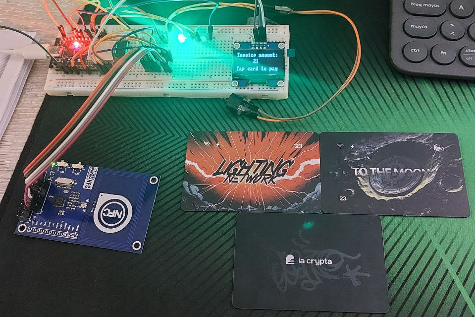

# POS lite nfc 

## Project hardware

## Pending

### Basic
- [ ] Fix limits of the invoice depend to LNURL.
- [ ] Optimize HTTP request functions.
- [ ] Increment invoice amount of 100 in 21. (eg. 100, 121, 200, 221, 300, ...).

### Intermediate
- [ ] Add more comments.
- [ ] Turn off NTAG424 debug.
- [ ] Error handling.
- [ ] Status LEDs.
- [ ] Customizable amount of invoice.
- [ ] Make a README as [mpr](https://github.com/mariano-perez-rodriguez) would like.

---

